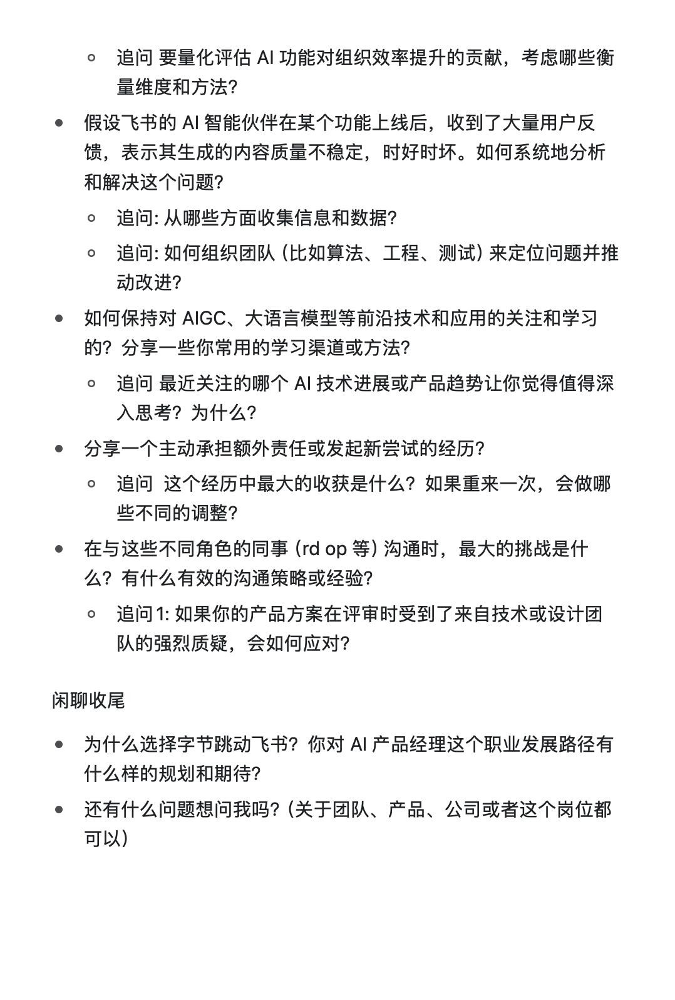

[toc]

# 正文

岗位名称：AI 大模型产品经理
面试时长：55mins
自评打分：5/10
是否下一轮：否。
原因：主要原因对 2b 的业务不够熟悉，对组织效率办公场景方向不够熟悉
对简历中的一段相关实习进行深度挖掘，用了 5why 提问，冒汗😅幸亏提前练习过
对当前LLM和 AIGC整体看法。你认为它们的核心能力、主要优势以及现阶段存在的局限性或挑战是什么？
追问: 在企业协作与飞书的场景下，你认为 LLM 最有潜力颠覆或显著提升效率的具体场景有哪些？请举 2-3 个例子，并说明为什么。
追问:飞书内有大语言模型驱动的 AI 智能伙伴，如果要为这个智能伙伴设计一套数据评估体系和评测集，你会考虑哪些核心维度和指标？为什么这些维度重要？
一个优秀的 AI 产品应该具备哪些特质？和你理解的传统软件产品相比，AI 产品在设计和迭代上有什么挑战？
追问: 分享一个你最近深度使用或研究过的 AI 产品，分析一下它的产品定位、目标用户、核心功能以及你认为它成功或有待改进的地方。
追问: 如果让你为飞书设计一个全新的、基于 LLM 的创新功能，你会从哪个用户痛点切入？这个功能的初步构想是什么？如何验证它的价值？
假设要为飞书文档增加一个 AI 助手功能，可以帮助用户快速撰写、润色、总结内容。描述一下从需求分析到产品设计，再到推动研发、设计团队合作落地的完整流程中，需要关注哪些关键节点和交付物？
追问 如何进行用户需求调研？调研哪些类型的用户？用什么方法？
追问 如何定义这个 AI 助手功能的 MVP？上线后，关注哪些数据指标来评估其效果并指导后续迭代？
追问 如果在研发过程中，技术团队反馈某个你设想的核心 AI 能力短期内难以完美实现，会如何调整产品方案或与团队沟通协调？
AI 功能的引入，会给飞书这样的办公套件带来哪些新的用户体验挑战？如何平衡 AI 的智能与用户的掌控感？
追问 举例说明一个你认为在用户交互方面做得好的 AI 功能，以及一个做得不好的？原因是什么？
是否有相关的编程经验？分享一个用编程解决实际问题或完成某个课程/个人项目的经历？
追问: 在这个项目中，你主要负责了哪些工作？遇到了什么技术难题，是如何解决的？
      


作者: [offer 满多多](https://www.xiaohongshu.com/user/profile/60032c7000000000010038e8)

发布时间：2025-5-22 15:33:25

发布位置：未知

收集时间：2025-8-17 23:14:4

原文地址：[字节跳动飞书ai 大模型产品-二面-面经](https://www.xiaohongshu.com/explore/682ed3450000000023003fbd?xsec_token=ABmMYngtDrsu3LvXpSPUBpYzIQPuhDqYzY2mXvOkGTxVk=&xsec_source=pc_feed) 

