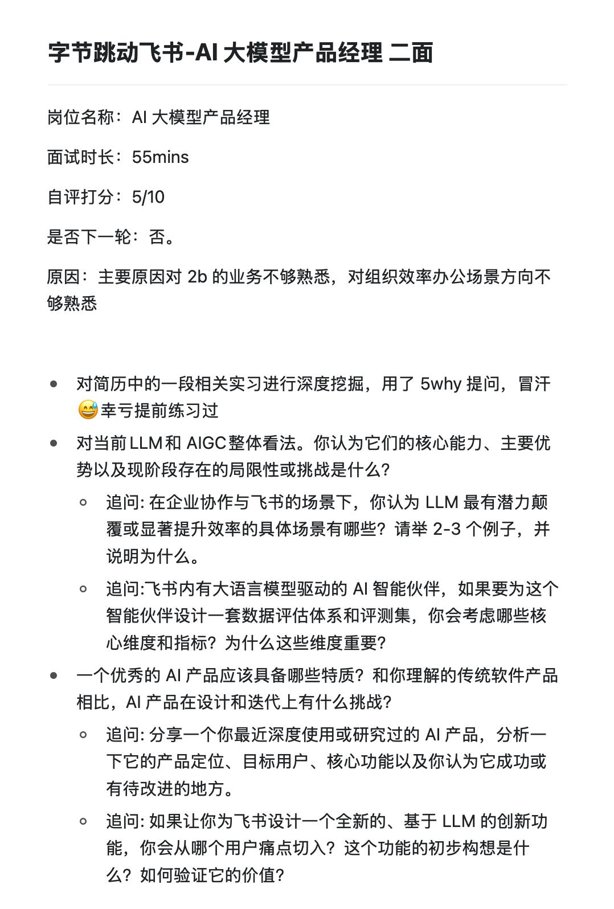
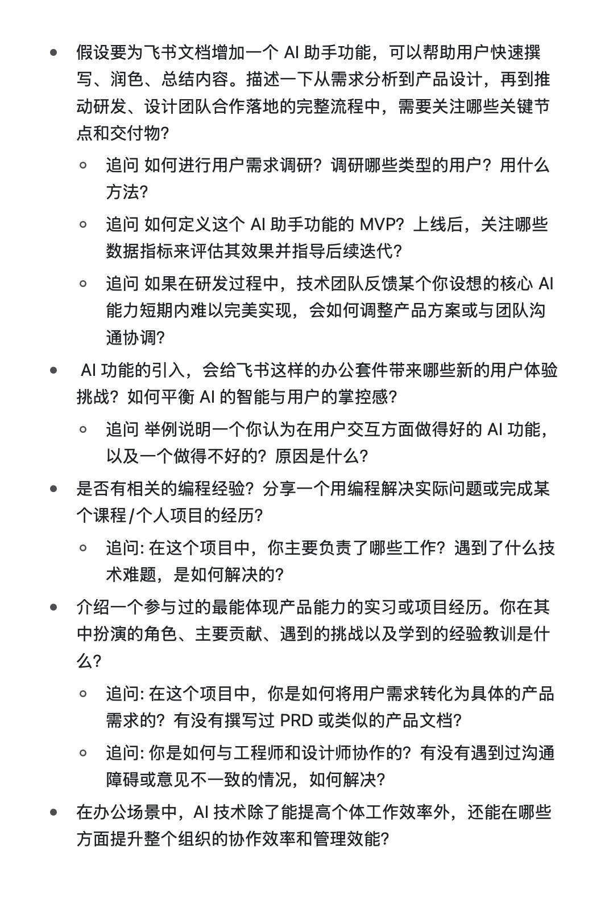

[toc]

# 正文

岗位名称：商分
自评打分：8/10
是否下一轮：是
挖简历的个人部分已经隐掉（建议深度复习简历），仅发出来通用考题：
	
广告团队发现，他们在“美妆”行业的市场份额正在被小红书和抖音蚕食。如果他们向你求助，希望你帮助他们分析原因并提出应对策略，你的第一步会做什么？你会先问他们哪三个最关键的问题，来启动你的分析？
	
如何理解“金融科技”这个领域？在你看来，腾讯的金融科技业务（以微信支付为核心）当前在中国市场面临的最大机会和挑战分别是什么？
	
追问： 如果让你去寻找腾讯金融科技的“下一个增长点”，你会从哪些方向或用户群体开始进行研究？
	
请你选择一个你熟悉的领域（例如，在线教育、企业服务SaaS、或大健康），分析一下为什么腾讯应该或不应该在现阶段大力投入这个领域。请阐述你的分析框架和理由。
	
如何为一个新项目设计一套效果评估体系。如果是公益项目，你会如何定义和量化这个项目的“社会价值”？
	
追问： 除了直接的产出指标（如捐款额、参与人数），你还会关注哪些能体现长期影响力的过程性或结果性指标？
	
一周时间，研究并提交一份关于“全球AIGC行业发展趋势”的报告，你要如何规划你这一周的工作？
	
追问： 你的研究大纲会包含哪些部分？你会通过哪些渠道去搜集和验证你的信息？
	
为什么选择腾讯来做商分，和战略咨询公司（如麦肯锡、贝恩）对比，这两种职业路径的主要异同点是什么？
	
选一个你熟悉的互联网产品，用一句话概括它的商业模式，并分析其成立的关键要素。
	
“为什么某款游戏的付费用户数在下降”，用一个分析框架来层层拆解这个问题可能的原因。
	
你认为一个优秀的商业分析师，除了扎实的分析能力，还需要具备哪些重要的软性素质？
	
追问： 请结合你过往的经历，举一个例子说明你是如何展现其中某项素质的。
	
         

作者: [offer 满多多](https://www.xiaohongshu.com/user/profile/60032c7000000000010038e8)

发布时间：2025-6-22 9:28:1

发布位置：未知

收集时间：2025-8-17 23:5:24

原文地址：[腾讯-CDG-商业分析-已过](https://www.xiaohongshu.com/explore/6856fd510000000020019713?xsec_token=ABrtfy-Da0UJ_m4UBP-fB9R47cezHlXwJzW63oOFG4Xzs=&xsec_source=pc_feed) 

